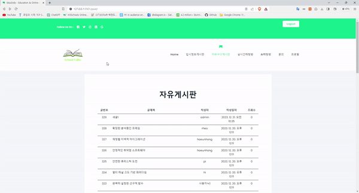
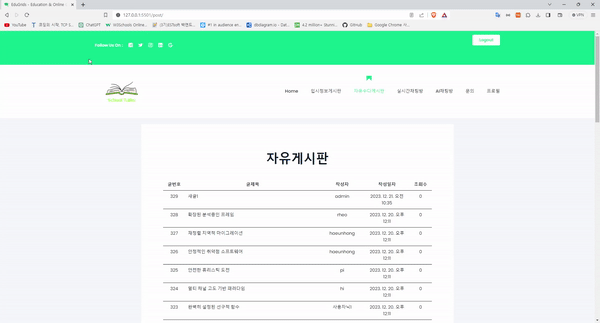
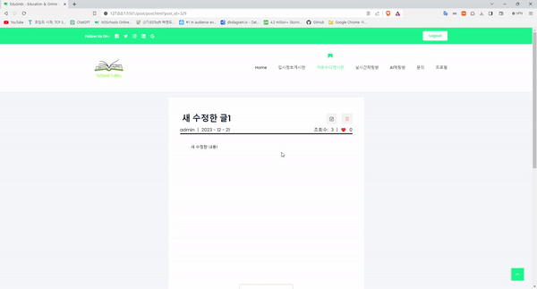
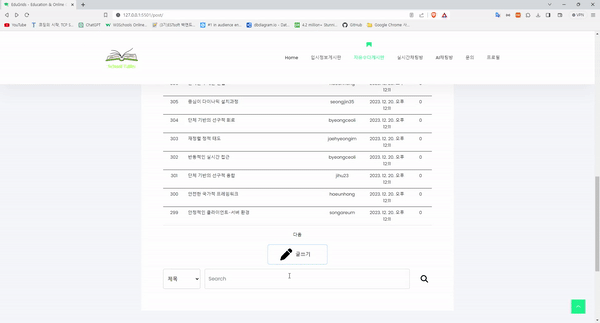
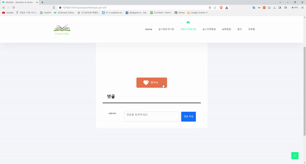
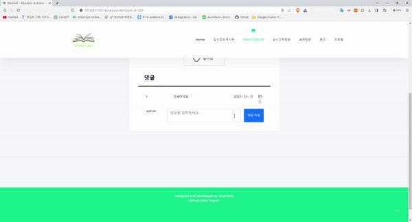
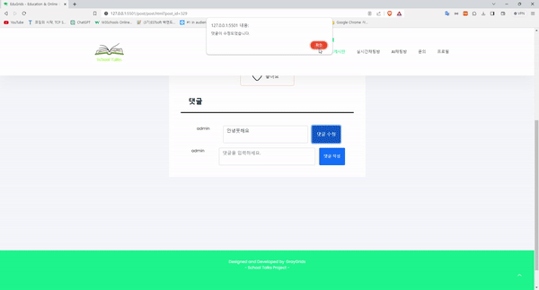

# [School Talks] DRF를 활용한 입시정보 커뮤니티 서비스


## 1. 목표와 기능

### 1.1 목표

-   고등학생들의 입시정보 및 생활정보 공유 서비스
-   대입에 대한 입시정보를 찾고, 일상생활을 공유하며 공감대를 형성하는 서비스
-   공부하다 지친 학생들이 편히 찾을 수 있는 커뮤니티

### 1.2 기능

-   기본 기능

    -   회원가입, 로그인, 프로필 기능
    -   커뮤니티 게시판 기능(입시게시판, 자유게시판 2개)
    -   실시간 채팅 기능

-   선택 기능
    -   AI 티칭 기능
    -   문의 기능

### 1.3 팀 구성

-   실제 사진을 업로드 하시길 권합니다.
<table>
    <tr>
        <th>김정원</th>
        <th>김동후</th>
        <th>김찬양</th>
        <th>황진경</th>
        <th>김창수</th>
    </tr>
    <tr>
        <td></td>
        <td></td>
        <td></td>
	<td></td>
        <td></td>
    </tr>
    <tr>
	<td>
            - Study, Qna, Chat BE & FE<br>
            - Accounts FE 연결<br>
            - 전체 프론트 효율 개선<br>
	    - 문서작업 	
        </td>
        <td>
            - AIchat 메인 담당 BE & FE<br>
	    - 문서작업	
        </td>
        <td>
            - Post 메인 담당 BE & FE<br>
            - 전체 프론트 코드 효율 개선<br>
	    - 문서작업
        </td>
        <td>
	    - Chat, AIChat 서브: 구현방법조사 및 FE수정<br>
	    - 문서작업
        </td>
        <td>
            - Accounts 메인 담당 BE<br>
	    - 문서작업
	</td>
    </tr>
</table>

## 2. 요구사항 명세와 기능 명세


-   기본 요구사항

    -   회원 관련 기능
    -   기능 최소 3가지 이상 구현 (회원 기능 포함)

-   선택 사항

    -   UI 추가

-   필수 결과물

    -   데이터베이스 구조(ERD)
    -   API 명세서(마크업, 노션, swagger… 등)
    -   발표 자료

-   평가 지표
    -   기술성: 모놀리식, 마이크로식, FBV와 CBV의 적절한 사용 등 Django의 적절한 사용
    -   DB설계: 데이터베이스 설계, DB 복잡도, 적절성(예를 들어 1개 모델에 1개 필드만 수십개 X)
    -   배포: nginx, gunicorn, django 등 연계하여 배포
    -   설계와 구현: 설계와 구현 복잡도(요구사항 작성, 와이어프레임, 기간 내 설계한 것들이 모두 구현이 되어 있는지 등)

## 3. 개발 환경 및 배포 URL

### 3.1 개발 환경

-   FE:

    
    
    

-   BE:

    
    

-   Deployment:

    [](https://github.com/)
    [](https://aws.amazon.com/lightsail/)
    [](https://ubuntu.com/)
    [](https://gunicorn.org/)
    [](https://nginx.org/)
    [](https://www.sqlite.org/)
    

### 3.2 배포 URL

-   BE : https://schooltalks.maxworld7070.net/
-   FE : https://schooltalks77.netlify.app/

### 3.3 CI/CD 구축 배포

-   BE Github Action 자동 배포
    
-   FE Netlify 자동 배포
    

## 4. URL 설계 & API 명세 및 사용 외부라이브러리

### 4.1 URL 설계 & API 명세

-   스웨거 문서(API 명세) : API 기능과 사용 방법을 명확히 전달 하기 위한 Swegger drf-yasg 사용하여 문서화

🖌 https://schooltalks.maxworld7070.net/schema/swagger-ui/

| 엔드포인트                    | HTTP 메서드             | 기능                                               | 앱             | 비고 |
| ----------------------------- | ----------------------- | -------------------------------------------------- | -------------- | ---- |
| /accounts/signup/             | POST                    | 새로운 User를 만들어주는 역할 (회원가입)           | Accounts       |      |
| /accounts/token/              | POST                    | 인증 토큰 생성 (로그인)                            | Authentication |      |
| /accounts/token/refresh/      | POST                    | 토큰 갱신                                          | Authentication |      |
| /accounts/token/verify/       | POST                    | 토큰 유효성 검사                                   | Authentication |      |
| /accounts/user/               | GET                     | 특정 사용자의 프로필 조회 (프로필 보기)            | User Profile   |      |
| /aichat/                      | GET, POST, DELETE       | AI와 채팅 (채팅 보기, 채팅 보내기, 전체 채팅 삭제) | AI Chat        |      |
| /chat/api/chat-messages/      | GET, POST               | 채팅 메시지 조회 및 생성                           | Chat           |      |
| /post/                        | GET, POST               | 글 목록 조회 및 글 작성                            | Posts          |      |
| /post/{id}/                   | GET, PUT, PATCH, DELETE | 특정 글 조회, 수정, 삭제                           | Posts          |      |
| /post/{post_id}/comment/{id}/ | DELETE, PUT, PATCH      | 특정 댓글 삭제, 수정                               | Comments       |      |
| /qna/inquiry/                 | GET, POST               | 문의 사항 조회 및 생성                             | QnA            |      |
| /qna/inquiry/{id}/            | GET, PUT, PATCH, DELETE | 특정 문의 사항 조회, 수정, 삭제                    | QnA            |      |
| /study/{id}/                  | GET, DELETE, PUT        | 특정 게시물 조회, 삭제, 수정                       | Study          |      |

### 4.2 사용 외부라이브러리

| 라이브러리                      | 버전    | 설명                                                                                            |
| ------------------------------- | ------- | ----------------------------------------------------------------------------------------------- |
| `djangorestframework`           | 3.14.0  | RESTful API 구축을 위한 강력한 툴킷을 Django에 제공                                             |
| `djangorestframework-simplejwt` | 5.3.1   | JWT 인증을 Django Rest Framework에 쉽게 통합할 수 있게 해주는 확장                              |
| `drf-spectacular`               | 0.26.5  | DRF 스키마 생성 및 문서화를 위한 확장으로, API 문서화 작업을 간소화                             |
| `channels[daphne]`              | ~4.0.0  | 비동기 웹소켓 처리 및 실시간 기능 구현의 지원을 위한 Django 확장으로, Daphne 서버를 포함        |
| `channels_redis`                | ~4.0.0  | Channels의 메시징 레이어에 대한 Redis 기반 백엔드 지원                                          |
| `redis`                         | !=4.4.0 | Redis 서버와의 통신을 위한 클라이언트 라이브러리, Channels의 백엔드로도 사용                    |
| `django-filter`                 | 23.5    | 강력한 필터링 기능을 제공하여, 동적으로 쿼리셋을 필터링, Django Rest Framework와 함께 많이 사용 |
| `python-dotenv`                 | 1.0.0   | `.env` 파일에서 환경 변수를 로드하여 Django 설정에 사용할 수 있게 해주는 도구                   |
| `openai`                        | 1.5.0   | OpenAI API를 사용하기 위한 공식 클라이언트 라이브러리, GPT-3 등의 AI 모델을 활용할 때 사용      |

## 5. 프로젝트 구조와 개발 일정

### 5.1 프로젝트 구조

```
# SCHOOLTALKS-BACKEND
├── 📁 .github
├── 📁 accounts
├── 📁 aichat
├── 📁 chat
├── 📁 media
├── 📁 post
├── 📁 project
├── 📁 qna
├── 📁 study
├── 📁 venv
├── 📄 .env
├── 📄 .gitignore
├── 📄 db.sqlite3
├── 📄 manage.py
├── 📘 README.md
└── 📄 requirements.txt

# SCHOOLTALKS-FRONTEND
├── 📁 .vscode
├── 📁 assets
│   ├── 📁 css
│   ├── 📁 fonts
│   ├── 📁 images
│   ├── 📁 js
│   └── 📁 mail
├── 📁 chat
├── 📁 gpt
├── 📁 post
├── 📁 study
├── 📄 header.html
├── 📄 index.html
├── 📄 license.txt
├── 📄 login.html
├── 📄 profile.html
├── 📄 qna.html
├── 📘 README.md
└── 📄 register.html

```

### 5.2 개발 일정(WBS)


## 6. 데이터베이스 모델링(ERD)


-   학습 게시물 테이블:

    -   다대일 관계: 사용자는 여러 게시물(StudyPost, Post), 댓글(StudyComment, Comment), 좋아요(StudyLike, Like)를 작성할 수 있음.

-   AI 대화 테이블(Conversation): AI와의 대화 내용 . 사용자의 입력(Prompt)와 AI의 답변(Response)를 저장.

    -   다대일 관계: 하나의 게시물은 여러 댓글(StudyComment)과 좋아요(StudyLike)를 받을 수 있음.

-   대화 테이블(Conversation): 사용자 간의 대화 내용 저장. 각 대화는 하나의 사용자에 의해 시작됨.

-   채팅 테이블(Chat): 채팅방 정보 저장. 각 채팅방은 여러 사용자가 참여할 수 있음.

## 7. Architecture


-   프론트엔드: HTML, CSS, JavaScript, Bootstrap으로 구성되며, Netlify를 통해 배포
-   백엔드: Python과 Django를 사용하고, SQLite 데이터베이스, Gunicorn WSGI, Nginx 웹 서버와 함께 Ubuntu 시스템에 AWS Lightsail로 배포

## 8. 기술성

## 9. 와이어프레임 / UI / BM

### 9.1 와이어프레임

-   아래 페이지별 상세 설명, 더 큰 이미지로 하나하나씩 설명 필요
    

-   와이어 프레임은 디자인을 할 수 있다면 '피그마'를, 디자인을 할 수 없다면 '카카오 오븐'으로 쉽게 만들 수 있습니다.

### 9.2 화면 설계

-   Accounts 앱
<table>
    <tbody>
        <tr>
            <td>메인</td>
            <td>로그인</td>
        </tr>
        <tr>
            <td>
		
            </td>
            <td>
		
            </td>
	</tr>
        <tr>
            <td>회원가입</td>
            <td>프로필</td>
        </tr>
        <tr>
            <td>
                
            </td>
            <td>
                
            </td>
        </tr>
        <tr>
	</tbody>
</table>


-   Post 앱
<table>
    <tbody>
        <tr>
            <td>자유게시판</td>
            <td>게시글 생성</td>
        </tr>
        <tr>
            <td>
                
            </td>
            <td>
                
            </td>
        </tr>
        <tr>
            <td>게시글 상세페이지</td>
            <td>게시글 수정</td>
        </tr>
        <tr>
            <td>
                
            </td>
            <td>
                
            </td>
        </tr>
	</tbody>
</table>

-   AI Chat 앱
<table>
    <tbody>
	<tr>
            <td>시작</td>
            <td>질문</td>
        </tr>
        <tr>
            <td>
                
            </td>
            <td>
                
            </td>
        </tr>
    </tbody>
</table>

-   Study 앱
<table>
    <tbody>
        <tr>
            <td>입시 정보 게시판</td>
            <td>게시글 생성</td>
        </tr>
        <tr>
            <td>
                
            </td>
            <td>
	        
            </td>
        </tr>
        <tr>
            <td>게시글 상세페이지</td>
            <td>게시글 수정</td>
        </tr>
        <tr>
            <td>
	        
            </td>
            <td>
                
            </td>
        </tr>
	</tbody>
</table>

-   Chat 앱

<table>
    <tbody>
	<tr>
            <td>익명실시간챗</td>
        </tr>
        <tr>
            <td>
                
            </td>
        </tr>
    </tbody>
</table>


-   QNA 앱
<table>
    <tbody>
	<tr>
            <td>문의</td>
        </tr>
        <tr>
            <td>
                
            </td>
        </tr>
    </tbody>
</table>

## 10. 메인 기능

📌 메인 페이지


- 서비스로 이동하는 아이콘이 반응할 수 있도록 함
- 사용자가 바로 이동할 수 있도록 네비게이션바와 배너를 생성

### accounts

📌 회원가입


-   회원가입 성공시 성공 메시지 생성
-   로그인 버튼 클릭 후 로그인 화면으로 이동 가능

📌 로그인


-   로그인 성공시 이전 페이지로 리다이렉트 됨
-   상단에 로그인 버튼이 사라지고 로그아웃 버튼이 생성됨

📌 로그아웃


-   로그아웃 성공시 로그아웃 버튼이 사라지고 로그인 버튼이 생성됨
-   다시 로그인 버튼을 클릭하여 로그인 하거나 회원가입을 할 수 있음

📌 프로필


-   회원 가입시 입력 정보를 프로필로 불러옴
-   회원 가입시 이미지 정보도 불러 오기 가능
  

### 자유게시판

📌 글 작성


-   자유게시판에 새로운 글을 작성
-   제목과 내용으로 구성되어있으며, 따로 제한없이 자유롭게 글을 쓸 수 있음
-   로그인한 사용자만 작성 가능

📌 글 보기


-   글 목록이 있음
-   글 제목을 클릭하면 상세보기로 들어가짐

📌 글 수정


-   자유게시판 글을 수정함
-   기존에 작성햇던 내용이 미리 들어가있음
-   작성자만 수정 가능

📌 좋아요


-   회색일떄 좋아요을 클릭하면 빨갛게 활성화되고 카운트가 1 오름
-   빨간색일떄 좋아요를 클릭하면 회색으로 비활성화되고 카운트가 1 내려감
-   사용자마다 각기 다른 좋아요 정보가 있음

📌 글 검색


-   제목, 내용, 제목+내용, 글쓴이 정보로 검색이 가능함

#### 자유게시판 댓글

📌 댓글 작성


-   로그인한 사용자는 글 상세보기에서 최하단에 댓글 작성이 있음
-   댓글내용을 적고 작성하면 등록됨

📌 댓글 수정


-   댓글 내용을 수정함
-   기존 댓글 내용이 미리 들어가있음
-   작성자만 수정 가능함.
-   수정시 한번 확인 알람이 있음.

📌 댓글 삭제


-   댓글을 삭제함
-   댓글 작성자만 삭제 가능함.


### AI 채팅 기능

📌 초기 화면


- AI 채팅을 시작할때, 이전 채팅 내역이 없다면 채팅 예시를 보여줌
  
📌 채팅


 - 질문을 입력하고 보내기 버튼을 누르면, AI의 말풍선이 생기고 잠시후 답변을 보여줌
  
📌 채팅 저장


- 유저의 질문과 AI의 답변은 DB에 저장됨
- 다른 화면에서 AI 채팅방으로 다시 왔을때 이전 채팅 내역을 보여줌
  
📌 채팅 삭제


- 삭제 버튼을 누르면 이전 채팅 내역이 모두 삭제되고 새로운 채팅을 시작함

### 입시정보게시판
📌 게시판 리스트 검색 및 페이지네이션


- 메모지형식의 게시판 구현
- 페이지네이션 이전 다음 버튼으로 구현
- 리스트 검색 기능 제목, 작성자, 내용에 따라 검색 가능


📌 게시글 CRUD


- 게시글 작성, 수정, 삭제, 읽기 가능

📌 좋아요 및 댓글 CRUD


-좋아요 기능 구현
-댓글 CRUD 가능

### QNA 게시판
📌 Q&A

- 자주 찾는 질문은 배너를 활용하여 게시함
- 메일, 카테고리, 문의내용을 통해 문의할 수 있음

### 채팅방
📌 익명 채팅방


- 익명으로 채팅에 참여할 수 있음
- 로그인하지 않아도 채팅에 참여할 수 있음

## 11. 에러와 에러 해결

-   에러명 : NameError:

-   문제:

```
NameError: name 'Post' is not defined SystemCheckError: System check identified some issues: ERRORS: post.Comment.author: (fields.E304) Reverse accessor 'User.comments' for 'post.Comment.author' clashes with reverse accessor for 'study.StudyComment.author'. HINT: Add or change a related_name argument to the definition for 'post.Comment.author' or 'study.StudyComment.author'. post.Comment.author: (fields.E305) Reverse query name for 'post.Comment.author' clashes with reverse query name for 'study.StudyComment.author'. HINT: Add or change a related_name argument to the definition for 'post.Comment.author' or 'study.StudyComment.author'. study.StudyComment.author: (fields.E304) Reverse accessor 'User.comments' for 'study.StudyComment.author' clashes with reverse accessor for 'post.Comment.author'. HINT: Add or change a related_name argument to the definition for 'study.StudyComment.author' or 'post.Comment.author'. study.StudyComment.author: (fields.E305) Reverse query name for 'study.StudyComment.author' clashes with reverse query name for 'post.Comment.author'. HINT: Add or change a related_name argument to the definition for 'study.StudyComment.author' or 'post.Comment.author'.
```

-   문제 원인:

    -   Django 모델에서 역 관계(accessor)와 역 질의(reverse query) 이름이 충돌하는 경우 발생
    -   게시판 study와 게시판 post가 합쳐지면서 비슷한 이름끼리 충돌하면서 생긴문제라 각 모델 관계이름을 변경 해야 했음.

-   해결 방법:

각 모델의 역 관계 이름을 명시적으로 설정하여 충돌을 해결. related_name 매개변수를 사용하여 각 모델의 관계 이름을 고유하게 지정가능.

-   예제:

```
python Copy code class Comment(models.Model): author = models.ForeignKey(User, on_delete=models.CASCADE, related_name='post_comments') # 다른 필드들...

class StudyComment(models.Model): author = models.ForeignKey(User, on_delete=models.CASCADE, related_name='study_comments') # 다른 필드들... 변경 후:
```

위와 같이 related_name을 설정한 후, makemigrations 및 migrate 명령을 실행하여 데이터베이스를 업데이트 -> 역 관계 이름 충돌 문제가 해결

## 12. 개발하며 알게 된 점 및 느낀점

-   가장 실무와 가까운 협업 프로젝트를 하는 건 처음이고, 특히 컨벤션 맞추는 부분이 어색하고 어려웠지만, 같이 문제를 해결하는 과정이 재미가 있었음.
-   또한 협업을 할 때 깃 환경을 어떻게 활용하는지 배우면서 팀프로젝트를 진행할 수 있었기 때문에 매우 도움이 되었던 팀프로젝트였음.
-   아직 부족한 점은 많지만 지난 DRF 개인 프로젝트에 비해 프론트서버랑 통신에서 오류잡는 시간이 단축 되었고, 또한 CI/CD 구축과 서버배포후 오류잡는 과정에서 더욱 성장 할 수 있었음
-   개인 프로젝트를 진행할 때와는 다르게 팀 프로젝트는 서로간의 커뮤니케이션이 많이 중요하다는걸 느낄수 있었음.
-   아직 부족하지만 이해하지 못했던 부분들을 계속 작업을 하면서 조금 더 이해할 수 있었고 노력하고 공부하는 만큼 발전되는 결과물을 볼 수 있었음.

## 13. 마무리 및 시연 영상
